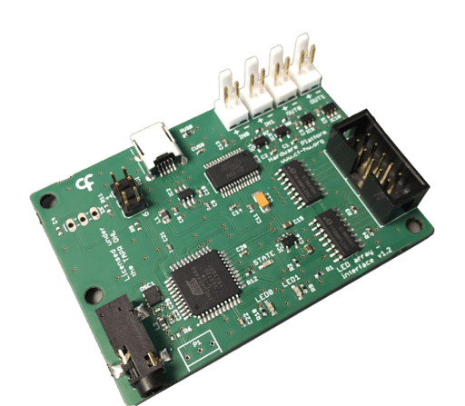

## Harp LED array

Controlling LED arrays that require more power. Ideally for opto-stimulation experiments.

### Key Features ###

* Controls up to 2 separate RGB LED
* Arrays and one common Infrared LED
* Two operation modes for each RGB LED Array: PWM or Interval

### Connectivity ###

* 1x clock sync input (CLKIN) [stereo jack]
* 1x USB (for computer) [USB type B]
* 1x flat cable
* 2x Digital Inputs (IN0, IN1) [flick lock male pins]
* 2x Digital Outputs (OUT0, OUT1) [flick lock male pins]
* 1x connector for 2 LED Arrays [10-pin flat-cable]

## Interface ##

The interface with the Harp board can be done through [Bonsai](https://bonsai-rx.org/) or a dedicated GUI (Graphical User Interface).

In order to use this GUI, there are some software that needs to be installed:

1 - Install the [drivers](https://bitbucket.org/fchampalimaud/downloads/downloads/UsbDriver-2.12.26.zip).

2 - Install the [runtime](https://bitbucket.org/fchampalimaud/downloads/downloads/Runtime-1.0.zip).

3 - Reboot the computer.

4 - Install the [GUI](https://bitbucket.org/fchampalimaud/downloads/downloads/Harp%20Led%20Array%20v2.2.0.zip).

## Licensing ##

Each subdirectory will contain a license or, possibly, a set of licenses if it involves both hardware and software.
